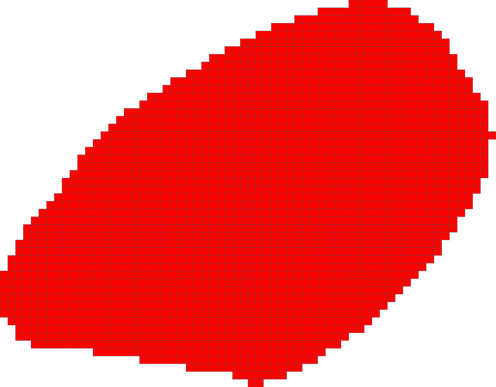
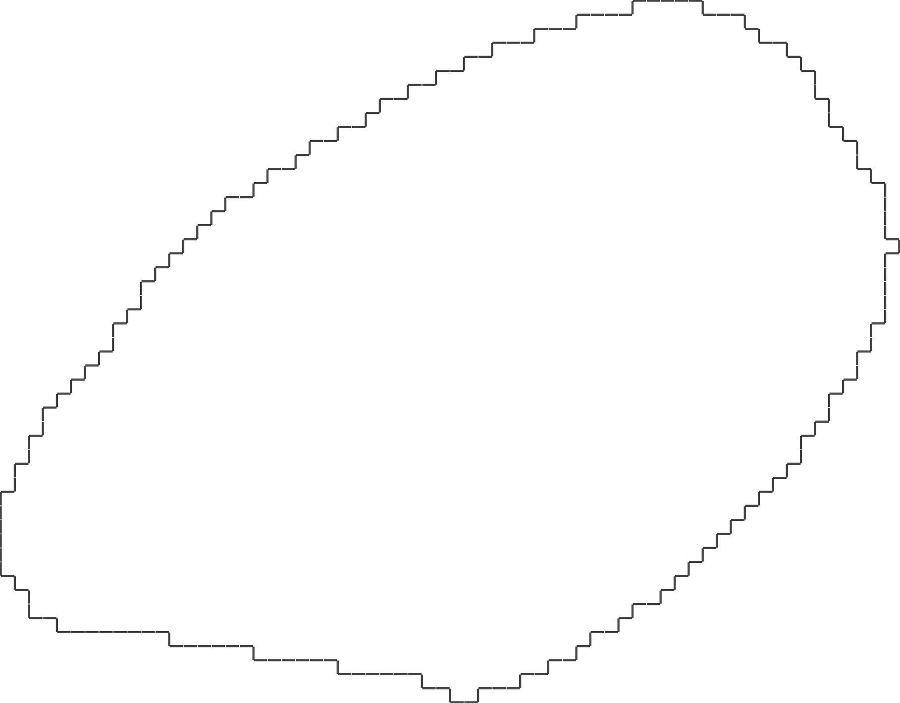

## Experiments

# STEP 1 : DOWNLOAD AND OBSERVE SEGMENTED IMAGES

 - (A) Basmati rice (Original: Rice_basmati.pgm; Segmented: Rice_basmati_seg_bin.pgm),
 - (B) Camargue rice (Original: Rice_camargue.pgm; Segmented: Rice_camargue_seg_bin.pgm),
 - (C) Japanese rice (Original: Rice_japanese.pgm; Segmented: Rice_japanese_seg_bin.pgm)

The rice (A) is Basmati rice, the general shape of the rice grain is that of a long slender cylinder, of ratio 1/5 width to height, in average.

The rice (B) is Camargue rice, the general shape of the rice grain is that of a short cylinder, of ratio 1/3 width to height, in average.

The rice (C) is Japanese rice, the general shape of the rice grain is that of an oval, of ratio 1/2 width to height, in average. This rice seems to be thicker in width as well, relative to the other rices.

 ** We will now treat the .pgm images, whose pixel values are either 0 or 255, for when the pixel is that of a grain of rice or not. **

# STEP 2 : COUNT GRAINS

1. 141 grains of Basmati rice
2. 132 grains of Camargue rice
3. 147 grains of Japanese rice

We can remove the grains that are not fully visible, as they are not fully segmented. We will then count the number of grains that are fully visible.

1. 124 grains of Basmati rice
2. 112 grains of Camargue rice
3. 138 grains of Japanese rice

We can visualize using SVG, the grains of rice that are fully visible.

<!-- svg for a single component -->

 ^ SVG of a single grain of Japanese rice.

--------------------

# STEP 3 : EXTRACT DIGITAL OBJECT BOUNDARY

For each connected component, we extract the inter-pixel boundary.

<!-- svg for a single component, japanese rice -->

 ^ SVG of the boundary of a single grain of Japanese rice.
