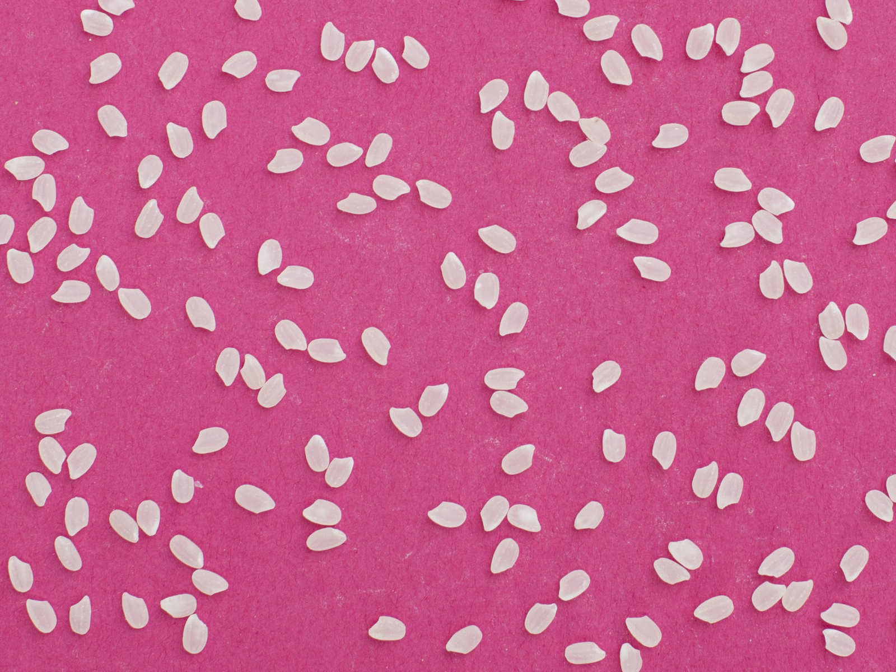

## Experiments

# STEP 1 : DOWNLOAD AND OBSERVE SEGMENTED IMAGES

 - (A) **Basmati rice** (Original: Rice_basmati.pgm; Segmented: Rice_basmati_seg_bin.pgm),
 - (B) **Camargue rice** (Original: Rice_camargue.pgm; Segmented: Rice_camargue_seg_bin.pgm),
 - (C) **Japanese rice** (Original: Rice_japanese.pgm; Segmented: Rice_japanese_seg_bin.pgm)

The rice (A) is Basmati rice, the general shape of the rice grain is that of a long slender cylinder, of ratio 1/5 width to height, in average.

The rice (B) is Camargue rice, the general shape of the rice grain is that of a short cylinder, of ratio 1/3 width to height, in average.

The rice (C) is Japanese rice, the general shape of the rice grain is that of an oval, of ratio 1/2 width to height, in average. This rice seems to be thicker in width as well, relative to the other rices.

 ** We will now treat the .pgm images, whose pixel values are either 0 or 255, for when the pixel is that of a grain of rice or not. **

# STEP 2 : COUNT GRAINS

1. 141 grains of Basmati rice
2. 132 grains of Camargue rice
3. 147 grains of Japanese rice

We can remove the grains that are not fully visible, as they are not fully segmented. We will then count the number of grains that are fully visible.

1. 124 grains of Basmati rice
2. 112 grains of Camargue rice
3. 138 grains of Japanese rice

We can see the grains of rice that are fully visible, and we can clearly see on the edges of the images that there argrains to remove for the rest of the lab work, to not bias towards lower values for the perimeter and areas.


 ^ File of the Japanese rice.

--------------------

# STEP 3 : EXTRACT DIGITAL OBJECT BOUNDARY

For each connected component, we extract the inter-pixel boundary.

<!-- svg for a single component, japanese rice -->

 ^ SVG of the boundary of a single grain of Japanese rice.

--------------------

# STEP 4 : POLYGONIZE DIGITAL OBJECT BOUNDARY


 ^ SVG of the polygon of a single grain of Japanese rice.

--------------------

# STEP 5 : CALCUALTE AREA

### Rice Japonais :

**Area statistics** (Number of 2-cells):

 - Average: 2068.46
 - Median: 2078
 - Minimum: 1744
 - Maximum: 2382

**Area statistics** (Polygon Area):

 - Average: 8272.46
 - Median: 8322.25
 - Minimum: 6957.5
 - Maximum: 9486

--------------------

### Rice Camargue :

**Area statistics** (Number of 2-cells):

 - Average: 2693.56
 - Median: 2829
 - Minimum: 921
 - Maximum: 3417

**Area statistics** (Polygon Area):

 - Average: 10771.7
 - Median: 11292.8
 - Minimum: 3674
 - Maximum: 13708

--------------------

### Rice Basmati :

**Area statistics** (Number of 2-cells):

 - Average: 2249.97
 - Median: 2321.5
 - Minimum: 801
 - Maximum: 3897

**Area statistics** (Polygon Area):

 - Average: 8998.58
 - Median: 9314.5
 - Minimum: 3181
 - Maximum: 15559.5

--------------------

## Observations

Although the means on both the Basmati and the Japanese rice are similar, their min and maxes vary wildly, and also encompase the Camargue, which has a higher mean. This suggests that the area of the grains is not a good indicator of the type of rice. We would also need to pay attention to the distance between the Camera and the grains, as the area of the grains would be affected by the distance, and the angle of the camera, and the zoom level, they would need to be standardized.

# STEP 6 : CALCULATE PERIMETER

### Rice Japonais :

**Perimeter Statistics** (Polygon Perimeter):

 - Average: 441.023
 - Median: 439.707
 - Minimum: 391.414
 - Maximum: 483.414
 - Standard Deviation: 17.5226

**Perimeter Statistics** (1-Cells Perimeter):

 - Average: 220.362
 - Median: 220
 - Minimum: 196
 - Maximum: 242

--------------------

### Rice Camargue :

**Perimeter Statistics** (Polygon Perimeter):

 - Average: 544.549
 - Median: 559.414
 - Minimum: 285.414
 - Maximum: 687.414
 - Standard Deviation: 69.4478

**Perimeter Statistics** (1-Cells Perimeter):

 - Average: 272.107
 - Median: 279
 - Minimum: 142
 - Maximum: 344

--------------------

### Rice Basmati :

 
**Perimeter Statistics** (Polygon Perimeter):

 - Average: 583.942
 - Median: 591.707
 - Minimum: 304
 - Maximum: 775.414
 - Standard Deviation: 82.1078

**Perimeter Statistics** (1-Cells Perimeter):

 - Average: 291.952
 - Median: 296
 - Minimum: 152
 - Maximum: 388

--------------------

## Observations

### Distinct Average Perimeters:

Rice Japonais has the smallest average perimeter.
Rice Camargue and Basmati have larger average perimeters.

### Variability:

Rice Japonais shows low variability (SD ≈ 17.5), indicating uniform grain sizes.
Rice Camargue and Basmati exhibit higher variability (SD ≈ 69.4 and 82.1), suggesting a wider range of sizes.

### Overlap in Perimeter Ranges:

Perimeter ranges for Camargue and Basmati overlap significantly.
Japonais's perimeter range is distinct from the others.

### Implications:

Perimeter can be a useful feature for distinguishing Japanese rice from the other two types, though Camargue and Basmati may be harder to differentiate based on this feature alone.

--------------------

## Multigrid take

### Theory

Multigrid convergence means that perimeter measurements should stay consistent as image resolution improves, since higher resolution captures boundaries more accurately. At lower resolution, boundaries can appear jagged, causing errors.

### Observed Results:

#### Rice Japonais:
- **Low variability** (SD ≈ 17.5).
- **Conclusion**: Likely follows multigrid convergence due to stable and uniform measurements.

#### Rice Camargue:
- **Moderate variability** (SD ≈ 69.4).
- **Conclusion**: Somewhat weaker convergence due to irregular shapes.

#### Rice Basmati:
- **High variability** (SD ≈ 82.1).
- **Conclusion**: Likely does not follow multigrid convergence due to elongated and irregular shapes.

Japonais rice aligns best with multigrid convergence, while Camargue and Basmati are less consistent. Testing at different resolutions would confirm this further.

--------------------

# STEP 7 : PROPOSE AND CALCULATE CIRCULARITY

### Conclusion on the Circularity Measure :

The circularity measure we used, defined as :

$$ ( 4𝜋*Area ) / ( Perimeter^2 ) $$

 --inherently ranges from 0 to 1. A value closer to 1 indicates a shape that is more perfectly circular, because for a true circle this formula yields exactly 1. As shapes become more elongated or irregular, their perimeter increases more rapidly than their area, causing the circularity value to decrease towards 0.

--------------------

### Implications on Different Grain Shapes :


#### Rice Japonais Circularity statistics :

 - Average: 0.527097
 - Median: 0.528177
 - Minimum: 0.475761
 - Maximum: 0.60165

#### Rice Camargue Circularity statistics :

 - Average: 0.450732
 - Median: 0.445229
 - Minimum: 0.327991
 - Maximum: 0.575507

#### Rice Basmati Circularity statistics :

 - Average: 0.332809
 - Median: 0.325142
 - Minimum: 0.248882
 - Maximum: 0.499553

Looking at the computed circularities, the Japonais grains have higher circularity values, suggesting they are more compact and closer to a rounded shape. The Camargue grains, with intermediate circularity, appear moderately elongated. The Basmati grains, showing the lowest circularities, are the most elongated and least circle-like. Thus, the circularity measure helps distinguish grain types by quantifying how closely their shapes resemble a circle—higher values correspond to more compact, rounded shapes and lower values correspond to more elongated, irregular ones.

Thus we can to some reasonable extent, distinguish between the three types of rice grains based on their circularity values.

--------------------

# STEP 8 (OPTIONAL): FIND USEFUL MEASURES FOR THE GRAIN CLASSIFICATION

.not implemented

# STEP 9 (OPTIONAL): CLASSIFICATION OF GRAINS

.not implemented

# STEP 10 (OPTIONAL): IMPROVE GRAIN SEGMENTATION

.not implemented

# Current console output of the program

```plaintext
*****************************
Number of files found: 3
*****************************


=============================
Processing file: resources/Rice_japonais_seg_bin.pgm
-----------------------------
Initial number of connected components: 147
Number of components removed: 9
Final number of connected components: 138
-----------------------------
Saved greedy DSS decomposition to: Rice_japonais_seg_bin_greedy-dss-decomposition.svg
-----------------------------
Area statistics (Number of 2-cells):
Average: 2068.46
Median: 2078
Minimum: 1744
Maximum: 2382
-----------------------------
Area statistics (Polygon Area):
Average: 8272.74
Median: 8322.25
Minimum: 6959
Maximum: 9485
-----------------------------
Perimeter statistics (Number of 1-cells):
Average: 220.362
Median: 220
Minimum: 196
Maximum: 242
-----------------------------
Perimeter statistics (Polygon Perimeter):
Average: 444.162
Median: 443.325
Minimum: 393.414
Maximum: 486
-----------------------------
Circularity statistics:
Average: 0.527097
Median: 0.528177
Minimum: 0.475761
Maximum: 0.60165
=============================


=============================
Processing file: resources/Rice_camargue_seg_bin.pgm
-----------------------------
Initial number of connected components: 132
Number of components removed: 20
Final number of connected components: 112
-----------------------------
Saved greedy DSS decomposition to: Rice_camargue_seg_bin_greedy-dss-decomposition.svg
-----------------------------
Area statistics (Number of 2-cells):
Average: 2693.56
Median: 2829
Minimum: 921
Maximum: 3417
-----------------------------
Area statistics (Polygon Area):
Average: 10771.9
Median: 11292.5
Minimum: 3674
Maximum: 13708
-----------------------------
Perimeter statistics (Number of 1-cells):
Average: 272.107
Median: 279
Minimum: 142
Maximum: 344
-----------------------------
Perimeter statistics (Polygon Perimeter):
Average: 547.622
Median: 562
Minimum: 285.414
Maximum: 694.606
-----------------------------
Circularity statistics:
Average: 0.450732
Median: 0.445229
Minimum: 0.327991
Maximum: 0.575507
=============================


=============================
Processing file: resources/Rice_basmati_seg_bin.pgm
-----------------------------
Initial number of connected components: 141
Number of components removed: 17
Final number of connected components: 124
-----------------------------
Saved greedy DSS decomposition to: Rice_basmati_seg_bin_greedy-dss-decomposition.svg
-----------------------------
Area statistics (Number of 2-cells):
Average: 2249.97
Median: 2321.5
Minimum: 801
Maximum: 3897
-----------------------------
Area statistics (Polygon Area):
Average: 8998.8
Median: 9315
Minimum: 3181
Maximum: 15559
-----------------------------
Perimeter statistics (Number of 1-cells):
Average: 291.952
Median: 296
Minimum: 152
Maximum: 388
-----------------------------
Perimeter statistics (Polygon Perimeter):
Average: 586.695
Median: 594
Minimum: 304
Maximum: 780
-----------------------------
Circularity statistics:
Average: 0.332809
Median: 0.325142
Minimum: 0.248882
Maximum: 0.499553
=============================

=============================
Analyzing perimeter distributions across files:
-----------------------------
File: resources/Rice_basmati_seg_bin.pgm
Number of grains: 124
Perimeter statistics (Polygon Perimeter):
Average: 586.695
Median: 594
Minimum: 304
Maximum: 780
Standard Deviation: 81.954
-----------------------------
File: resources/Rice_camargue_seg_bin.pgm
Number of grains: 112
Perimeter statistics (Polygon Perimeter):
Average: 547.622
Median: 562
Minimum: 285.414
Maximum: 694.606
Standard Deviation: 69.6763
-----------------------------
File: resources/Rice_japonais_seg_bin.pgm
Number of grains: 138
Perimeter statistics (Polygon Perimeter):
Average: 444.162
Median: 443.325
Minimum: 393.414
Maximum: 486
Standard Deviation: 17.758
=============================


All files processed successfully.
```
